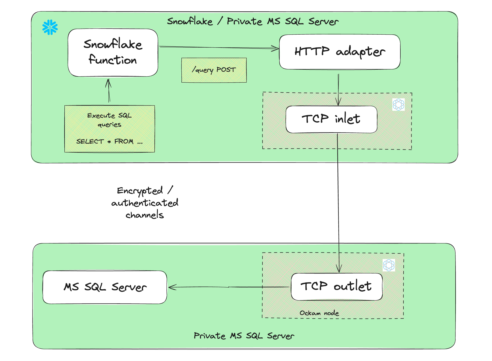

# Access Microsoft SQL Server from Snowpark Container Services



## Get started with Ockam

[Signup for Ockam](https://www.ockam.io/signup) and then run the following commands on your workstation:

```sh
# Install Ockam Command
curl --proto '=https' --tlsv1.2 -sSfL https://install.command.ockam.io | bash && source "$HOME/.ockam/env"

# Enroll with Ockam Orchestrator.
ockam enroll

# Create an enrollment ticket for the node that will run from a linux machine where thesql server is reachable from
ockam project ticket --usage-count 1 --expires-in 4h --attribute mssql --relay mssql > mssql_outlet.ticket

```

## Setup Ockam node next to MS SQL Server

- Copy `setup_ockam_outlet.sh` to the linux machine where the MS SQL Server is reachable from.
- Copy `mssql_outlet.ticket` to the same location as `setup_ockam_outlet.sh` script

```sh
# Run the setup script
chmod +x setup_ockam_outlet.sh
DB_ENDPOINT="HOST:1433" ./setup_ockam_outlet.sh
```

## Setup Snowflake

- Create the database, schema, role, compute pool, warehouse, and image repository.

```sh
# Run the init script and get the repository URL
snowsql -f snowflake_scripts/init.sql && \
repository_url=$(snowsql -o output_format=csv -o header=false -o timing=false \
  -q "SHOW IMAGE REPOSITORIES;" | grep 'MSSQL_API_DB' | cut -d',' -f5 | tr -d '"') && \
echo "Repository URL: $repository_url"
```

> **Note**
> Respository URL will be similar to `XXX.registry.snowflakecomputing.com/mssql_api_db/mssql_api_schema/mssql_api_repository`


## Push Ockam docker image and MS SQL Server client docker image

```sh
# Login to the repository
docker login $repository_url

# Push the Ockam docker image
ockam_image="ghcr.io/build-trust/ockam:0.146.0@sha256:b13ed188dbde6f5cae9d2c9c9e9305f9c36a009b1e5c126ac0d066537510f895"
docker pull $ockam_image && \
docker tag $ockam_image $repository_url/ockam:latest && \
docker push $repository_url/ockam:latest

# Build and Push the MS SQL Server client docker image
cd mssql_client && \
docker buildx build --platform linux/amd64 --load -t $repository_url/mssql_client:latest . && \
docker push $repository_url/mssql_client:latest && \
cd -
```

## Create an Ockam node and API Client to connect to MS SQL Server in Snowpark Container Services

- Create network rules to allow the Ockam node to connect to your ockam project and for python client to connect to`ocsp.snowflakecomputing.com`

```bash
# Run from the same machine where you had enrolled to ockam project and created tickets
snowsql -f snowflake_scripts/access.sql --variable egress_list=$(ockam project show --jq '.egress_allow_list[0]')
```

- Create Service

```bash
# Replace the `TODO` values with the values for MS SQL Server
snowsql -f snowflake_scripts/service.sql \
  --variable ockam_ticket="$(ockam project ticket --usage-count 1 --expires-in 10m --attribute snowflake)" \
  --variable mssql_database="TODO" \
  --variable mssql_user="TODO" \
  --variable mssql_password="TODO"
```

- Ensure container services are running

```sql
-- Check service status
USE WAREHOUSE MSSQL_API_WH;
USE ROLE MSSQL_API_ROLE;
USE DATABASE MSSQL_API_DB;
USE SCHEMA MSSQL_API_SCHEMA;

SHOW SERVICES;
SELECT SYSTEM$GET_SERVICE_STATUS('MSSQL_API_CLIENT');

-- Check service logs
CALL SYSTEM$GET_SERVICE_LOGS('MSSQL_API_CLIENT', '0', 'http-endpoint', 100);
CALL SYSTEM$GET_SERVICE_LOGS('MSSQL_API_CLIENT', '0', 'ockam-inlet', 100);
```

> [!IMPORTANT]
> - `http-endpoint` is the endpoint that will be used to connect to the MS SQL Server. You will see `Successfully connected to SQL Server` in the logs upon successful connection.
> - `ockam-inlet` is the endpoint that will be used to connect to the Ockam node. Logs will indicate if there are any errors starting the node.

## Create Functions and Stored Procedures to use the API

```bash
# Run the functions script to create the stored procedures and functions
snowsql -f snowflake_scripts/functions.sql

```

## Access MS SQL Server from Snowflake

- Below are some examples of how to access MS SQL Server from Snowflake

__Execute a statement__

```sql

USE WAREHOUSE MSSQL_API_WH;
USE ROLE MSSQL_API_ROLE;
USE DATABASE MSSQL_API_DB;
USE SCHEMA MSSQL_API_SCHEMA;

CALL OCKAM_MSSQL_EXECUTE($$
IF NOT EXISTS (SELECT * FROM sys.tables WHERE name = 'PETS')
BEGIN
    CREATE TABLE PETS (
        NAME NVARCHAR(100),
        BREED NVARCHAR(100)
    );
END
$$);
```

__Insert data__

```sql
CALL OCKAM_MSSQL_EXECUTE($$
INSERT INTO PETS VALUES ('Toby', 'Beagle');
$$);
```

__Query the PostgreSQL database__

```sql
CALL OCKAM_MSSQL_QUERY('SELECT * FROM PETS');
```

__Join PostgreSQL and Snowflake tables__

```sql
-- Create two similar tables `PETS`, in MS SQL Server and Snowflake, but with different fields

-- MS SQL Server

CALL OCKAM_MSSQL_EXECUTE($$
IF OBJECT_ID('PETS', 'U') IS NOT NULL
    DROP TABLE PETS;

IF NOT EXISTS (SELECT * FROM sys.tables WHERE name = 'PETS')
BEGIN
    CREATE TABLE PETS (
        NAME NVARCHAR(100),
        BREED NVARCHAR(100)
    );
END;

INSERT INTO PETS VALUES ('Max', 'Golden Retriever');
INSERT INTO PETS VALUES ('Bella', 'Poodle');
$$);

-- Snowflake

CREATE TABLE IF NOT EXISTS PETS (NAME VARCHAR(100), YEAR_OF_BIRTH INT);
INSERT INTO PETS VALUES ('Max',  2018);
INSERT INTO PETS VALUES ('Bella', 2019);


-- First we query the remote MS SQL Server
CALL OCKAM_MSSQL_QUERY('SELECT * FROM PETS');
SET pets_query=LAST_QUERY_ID();

-- Join the results of the MS SQL Server query with the Snowflake table
SELECT * FROM TABLE(RESULT_SCAN($pets_query)) as MSSQL_PETS
    INNER JOIN PETS ON MSSQL_PETS.NAME = PETS.NAME;
```

## Clean up

```bash
snowsql -f snowflake_scripts/cleanup.sql
```
