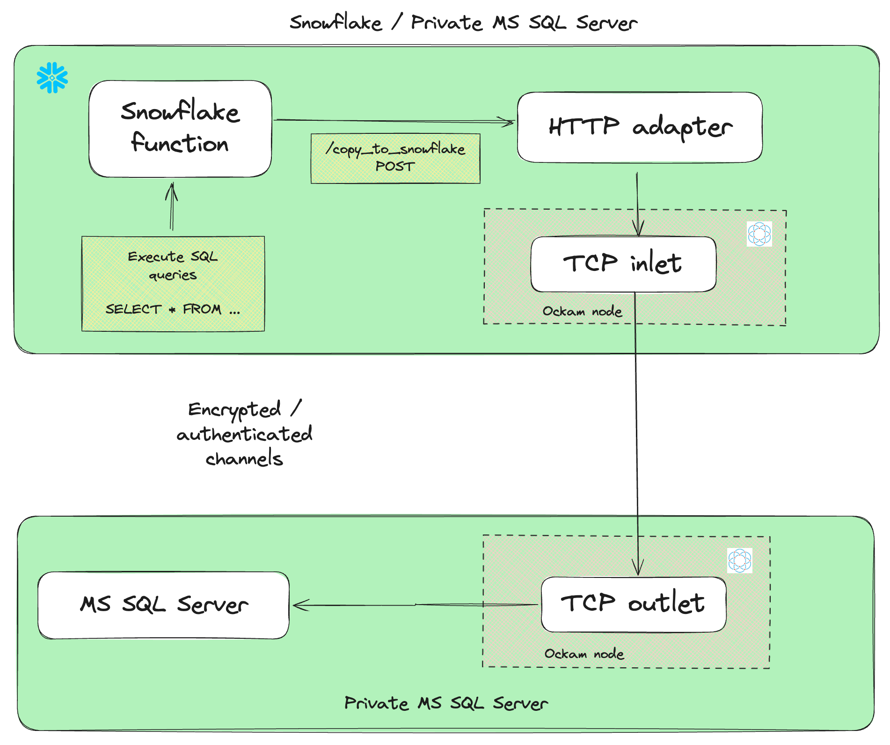

# Microsoft SQL Server to Snowflake Migration



## Prerequisites

- curl
- Ockam
- Snowflake Account
- Microsoft SQL Server
- snowsql
- docker


## Get started with Ockam

[Signup for Ockam](https://www.ockam.io/signup) and then run the following commands on your workstation:

```sh
# Install Ockam Command
curl --proto '=https' --tlsv1.2 -sSfL https://install.command.ockam.io | bash && source "$HOME/.ockam/env"

# Enroll with Ockam Orchestrator.
ockam enroll

# Create an enrollment ticket for the node that will run from a linux machine where thesql server is reachable from
ockam project ticket --usage-count 1 --expires-in 4h --attribute mssql --relay mssql > mssql_outlet.ticket

```

## Setup Ockam node next to MS SQL Server

- Copy `setup_ockam_outlet.sh` to the linux machine where the MS SQL Server is reachable from.
- Copy `mssql_outlet.ticket` to the same location as `setup_ockam_outlet.sh` script

```sh
# Run the setup script
chmod +x setup_ockam_outlet.sh
DB_ENDPOINT="HOST:1433" ./setup_ockam_outlet.sh
```

- Create a demo table in MS SQL Server to follow the example

```sql
-- Create the database
CREATE DATABASE ockam_mssql_demo;
GO

-- Use the database
USE ockam_mssql_demo;
GO

-- Create the table
CREATE TABLE customers (id INT PRIMARY KEY, name VARCHAR(100));
GO

-- Insert some data
INSERT INTO customers (id, name) VALUES (1, 'John Doe');
INSERT INTO customers (id, name) VALUES (2, 'Jane Smith');
INSERT INTO customers (id, name) VALUES (3, 'Bob Johnson');

GO
```

## Setup Snowflake
- Configure `snowsql` with the snowflake account details

- Create the database, schema, role, compute pool, warehouse, and image repository.

```sh
# Run the init script and get the repository URL
snowsql -f snowflake_scripts/init.sql && \
repository_url=$(snowsql -o output_format=csv -o header=false -o timing=false \
  -q "SHOW IMAGE REPOSITORIES;" | grep 'MSSQL_CONNECTOR_DB' | cut -d',' -f5 | tr -d '"') && \
echo "Repository URL: $repository_url"
```

> **Note**
> Respository URL will be similar to `XXX.registry.snowflakecomputing.com/mssql_connector_db/mssql_connector_schema/mssql_connector_repository`


## Push Ockam docker image and MS SQL Server client docker image

```sh
# Login to the repository
docker login $repository_url

# Push the Ockam docker image
ockam_image="ghcr.io/build-trust/ockam:0.146.0@sha256:b13ed188dbde6f5cae9d2c9c9e9305f9c36a009b1e5c126ac0d066537510f895"
docker pull $ockam_image && \
docker tag $ockam_image $repository_url/ockam:latest && \
docker push $repository_url/ockam:latest

# Build and Push the MS SQL Server client docker image
cd mssql_client && \
docker buildx build --platform linux/amd64 --load -t $repository_url/mssql_client:latest . && \
docker push $repository_url/mssql_client:latest && \
cd -
```

## Create an Ockam node and Python Client to connect to MS SQL Server in Snowpark Container Services

- Create network rules to allow the Ockam node to connect to your ockam project and for python client to connect to`ocsp.snowflakecomputing.com`

```bash
# Run from the same machine where you had enrolled to ockam project and created tickets
snowsql -f snowflake_scripts/access.sql --variable egress_list=$(ockam project show --jq '.egress_allow_list[0]')
```

- Create Service

```bash
# Replace the `TODO` values with the values for MS SQL Server
snowsql -f snowflake_scripts/service.sql \
  --variable ockam_ticket="$(ockam project ticket --usage-count 1 --expires-in 10m --attribute snowflake)" \
  --variable mssql_database="TODO" \
  --variable mssql_user="TODO" \
  --variable mssql_password="TODO"
```

- Ensure container services are running

```sql
-- Check service status
USE WAREHOUSE MSSQL_CONNECTOR_WH;
USE ROLE MSSQL_CONNECTOR_ROLE;
USE DATABASE MSSQL_CONNECTOR_DB;
USE SCHEMA MSSQL_CONNECTOR_SCHEMA;

SHOW SERVICES;
SELECT SYSTEM$GET_SERVICE_STATUS('MSSQL_CONNECTOR_CLIENT');

-- Check service logs
CALL SYSTEM$GET_SERVICE_LOGS('MSSQL_CONNECTOR_CLIENT', '0', 'http-endpoint', 100);
CALL SYSTEM$GET_SERVICE_LOGS('MSSQL_CONNECTOR_CLIENT', '0', 'ockam-inlet', 100);
```

> [!IMPORTANT]
> - `http-endpoint` is the endpoint that will be used to connect to the MS SQL Server. You will see `Successfully connected to SQL Server` in the logs upon successful connection.
> - `ockam-inlet` is the endpoint that will be used to connect to the Ockam node. Logs will indicate if there are any errors starting the node.

## Create table in Snowflake and grant access to the role

```sql
--Create demo table in Snowflake
CREATE TABLE MSSQL_CONNECTOR_DB.MSSQL_CONNECTOR_SCHEMA.CUSTOMERS (id INT PRIMARY KEY, name VARCHAR(100));

--Grant access to the role
GRANT SELECT, INSERT, UPDATE, DELETE, TRUNCATE ON TABLE MSSQL_CONNECTOR_DB.MSSQL_CONNECTOR_SCHEMA.CUSTOMERS TO ROLE MSSQL_CONNECTOR_ROLE;

```

## Create Stored Procedure to execute the function

```bash
# Run the functions script to create the stored procedures and functions
snowsql -f snowflake_scripts/functions.sql

```

## Access MS SQL Server from Snowflake

- Copy data from MS SQL Server to Snowflake

```sql
-- Copy data from MS SQL Server to Snowflake
CALL ockam_mssql_copy(
    'SOURCE_TABLE',
    'TARGET_TABLE'
);

-- Example using demo tables created in MS SQL Server and Snowflake
CALL ockam_mssql_copy(
    'ockam_mssql_demo.dbo.customers',
    'MSSQL_CONNECTOR_DB.MSSQL_CONNECTOR_SCHEMA.CUSTOMERS'
);
```

## Clean up

```bash
snowsql -f snowflake_scripts/cleanup.sql
```
